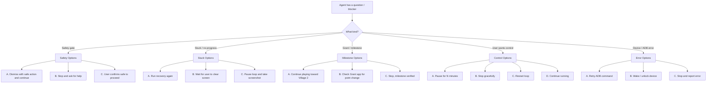

# Gameplay Agent Option Tree

Use this artifact whenever the live Coin Master / Grant gameplay agent has a
question, hits a blocker, or needs user direction. Present the relevant options
to the user and wait for their choice before continuing.

## When to use this tree

- A safety-sensitive screen appears (purchase, auth, payment, identity, legal,
  survey, permission).
- The agent is stuck and recovery did not help.
- A Grant milestone may have been reached.
- The user interrupts or asks a question mid-run.
- ADB/device errors persist.
- The agent is uncertain which action is safe.

## Decision flow

## Option tables

### 1. Safety gate triggered

Use when the screen contains purchase, sign-in, payment, identity, legal/terms,
survey, or permission prompts.

| Option | User says | Agent action |
|--------|-----------|--------------|
| **A** | "Close it and keep going" | Use the safest allowed dismiss action (back key, top-right X, or `close`). Do **not** confirm/sign-in/pay. Continue the loop. |
| **B** | "Stop" | Create `runtime/gameplay_loop.stop`, stop the loop, and report exactly what was on screen. |
| **C** | "This is safe, proceed" | Only proceed if the screen is a normal gameplay modal (reward, ad close, OK, skip). Never proceed with auth/payment/identity/legal flows. |

### 2. Stuck / no progress

Use when rolls/builds are not increasing, the same screen stays for several
minutes, or recovery keeps firing.

| Option | User says | Agent action |
|--------|-----------|--------------|
| **A** | "Try recovery again" | Run the recovery sequence once (back key → close → continue → dice roll). |
| **B** | "I will clear it" | Pause the loop for 2 minutes, then resume once the user says "go". |
| **C** | "Show me a screenshot" | Capture and display the current screen, then wait for the user's next instruction. |

### 3. Grant milestone

Use when Village 2 may be complete or Grant points might have increased.

| Option | User says | Agent action |
|--------|-----------|--------------|
| **A** | "Keep playing" | Continue the gameplay loop; do not switch apps. |
| **B** | "Check Grant" | Pause the loop, switch to Grant (`com.kikoff.theseus`), capture the offer screen, then return to Coin Master and resume. |
| **C** | "We are done" | Stop the loop and report final metrics and any observed Grant change. |

### 4. User control

Use when the user asks to pause, stop, or restart.

| Option | User says | Agent action |
|--------|-----------|--------------|
| **A** | "Pause for X minutes" | Note the pause, resume automatically after X minutes, or ask the user to say "resume". |
| **B** | "Stop" | Create `runtime/gameplay_loop.stop` and let the loop exit cleanly. |
| **C** | "Restart" | Stop any running loop, then start a fresh loop process. |
| **D** | "Continue" | Keep running with the current strategy. |

### 5. Device / ADB error

Use when screenshots fail, ADB disconnects, or the device is locked.

| Option | User says | Agent action |
|--------|-----------|--------------|
| **A** | "Retry" | Retry the failed ADB command up to 3 times with 5-second delays. |
| **B** | "Wake the device" | Send `adb shell input keyevent 26` (power) and swipe to unlock if needed, then retry. |
| **C** | "Stop and report" | Stop the loop and report the exact error and device state. |

## How to present options

When you need input, reply in this format:

> **Situation:** [one-line description of what the agent sees]
>
> **Options:**
> - **A.** [option text]
> - **B.** [option text]
> - **C.** [option text]
>
> Reply with the letter or the action you want.

Wait for the user to choose. Do **not** take a default action unless the user
explicitly says "continue" or "do the safe thing".

## Files involved

- `runtime/gameplay_loop.stop` — create to stop the loop gracefully
- `runtime/gameplay_loop.log` — recent actions
- `runtime/gameplay_loop.metrics.json` — counters and timestamps
- `runtime/loop_watchdog.log` — watchdog status
